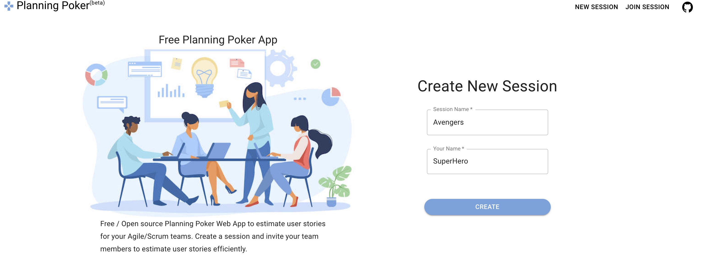
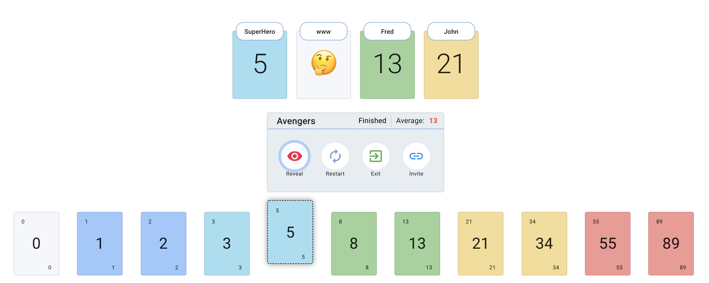

<h1 align="center">Neptune Poker App</h1>

Free / Open source Scrum/Agile Neptune Poker Web App to estimate user stories for the Agile/Scrum teams. Create session and invite team members to estimate user stories efficiently. Intuitive UI/UX for voting the story points, showing team members voting status with emojis(👍 - Voting Done, 🤔 - Yet to Vote). Session Moderator has full control on revealing story points and restarting the session.

<div align="center">
  
[](https://github.com/hellomuthu23/planning-poker/actions/workflows/build-and-tests.yml)
[](https://github.com/hellomuthu23/planning-poker/actions/workflows/deploy-to-firebase-on-master.yml)

</div>

## Live Site

- <https://planning-poker-agile.web.app/>

## Home Page



## Active Session



## Features

1. Create new Session(Fibonacci, Short Fibonacci, TShirt size or Custom)
2. Join Session
3. Invite Link
4. Share User story name/number with others using the board
5. Session controller - Moderator can Reveal and restart the session anytime.
6. Reveal - Reveal the cards for all users
7. Voting status - Users Cards show voting status using emojis - 👍 - Voting Done, 🤔 - Yet to Vote
8. Remove user from session
9. Delete Session - Moderator can delete the session completely
10. Dark Theme Support
11. Multiple language support
12. Mobile/Tablet screen support
13. Timer 

## Tech Stack

1. React - Frontend
2. Tailwind CSS - For styling
3. Firestore - Database
4. Firebase - Hosting

## How to run the app locally for development

Pre-req

- Register the [firebase project](https://firebase.google.com/docs/web/setup) and enable firestore and hosting
- Node.js version 16.0 or higher.
- Yarn
- Java JDK version 11 or higher.(for firestore db emulator)

1. Clone the repo

   ```bash
   git clone https://github.com/bmnidhin/planning-poker
   ```

1. Run `yarn` command to install the required npm package.
1. Install the Firebase CLI

   ```bash
   npm install -g firebase-tools
   ```

1. Start the firebase db emulator (optional)

   ```bash
   npm run start:emulator
   ```
1. Copy `.env.example` file as `.env`
1. Map contents of [Firebase config object](https://firebase.google.com/docs/web/learn-more#config-object) to `.env`
1. Run `yarn start` to start the app.
1. Access the app at `http://localhost:3000`.

## Creating container with Podman

pre-req

- Podman 

```
podman machine start
```

1. Build the app using below command.

   ```bash
   npm run build
   ```

2. Build container image

   ```bash
   podman build -t appcon-neptune/scrum-poker . 
   ```

3. Running the container

   ```bash
   podman run -it -p 8080:8080 -p 3000:3000  planning-poker
   ```

4. Wait for both emulator and app to start
5. Access the app from local container using <http://localhost:3000>

## Deploying to Firebase Hosting - from local

1. Follow steps of the section - How to run the app locally for development
1. Build the app using below command.

   ```bash
   npm run build
   ```
1. To deploy to your site, run the following command from the root of your local project directory:

   ```bash
   firebase deploy
   ```

## Deploy to Firebase Hosting - with GitHub Actions

1. Make sure unit tests are passing
1. Make sure secrets listed in `.github/workflows/deploy-to-firebase-on-master.yml` are added to [Github Action's secrets](https://github.com/bmnidhin/planning-poker/settings/secrets/actions)
1. Add a commit against `master`

## Development Guidelines

1. Keep it simple as much as possible
2. Add required unit tests
3. Use strong type always
4. Use functional and hooks based approach for components
5. Avoid adding new colors
6. Use tailwind utility classes for styling the components
7. Don't duplicate code and use service folder to keep non-component/shared codes

